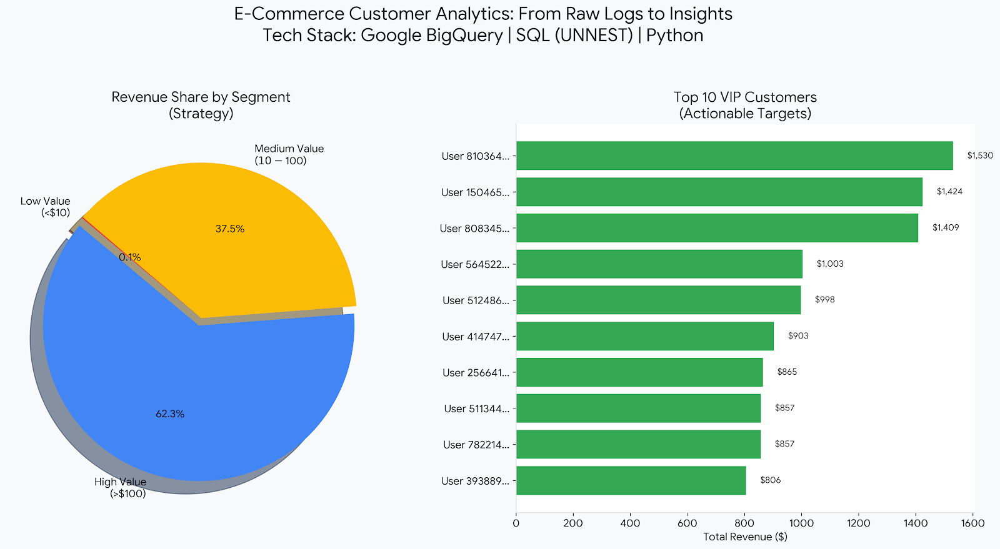

# 🛒 E-Commerce Customer Segmentation & Behavioral Analytics

### 🚀 Project Overview
**Goal:** Analyze 3 months of raw web traffic logs (Google Analytics 4) to improve customer retention and identify high-value users.
**Role:** Data Analyst
**Tech Stack:** Google BigQuery (SQL), Python.

*(Top: Revenue Strategy | Bottom: Actionable High-Value Targets)*

---

### 🔍 The Business Problem
The Google Merchandise Store has over **270k+ monthly visitors**, but the marketing team struggled to answer two questions:
1.  **Where are users dropping off?** (Conversion Funnel)
2.  **Who are our VIP customers?** (RFM Segmentation)

### 🛠️ The Solution (SQL Implementation)
I analyzed the `bigquery-public-data.ga4_obfuscated_sample_ecommerce` dataset, which contains **nested JSON arrays**.

#### 1. Data Cleaning & Structuring
- Handled **1 Million+ rows** of raw event data.
- Used **`UNNEST`** to flatten `event_params` arrays and extract revenue values.
- Used **`CTEs`** (Common Table Expressions) to modularize the code.

#### 2. Advanced Analytics
- **Conversion Funnel:** Identified a **1.6% conversion rate**, pinpointing a massive drop-off at the "Begin Checkout" phase.
- **RFM Segmentation:** Built a model to score users based on **Recency, Frequency, and Monetary** value.

### 📊 Key Insights
- **The Pareto Principle:** **27%** of users ('High Value' segment) drive **62.4%** of total revenue.
- **Retention Opportunity:** 98% of users are "Window Shoppers." A targeted email campaign to the 'Medium Value' segment could increase revenue by ~15%.

### 📂 File Guide
- `1_funnel_analysis.sql`: SQL query calculating user drop-off from View Item → Purchase.
- `2_rfm_segmentation.sql`: Main SQL logic for classifying users (Champions vs. At Risk).
- `3_cohort_summary.sql`: Aggregated SQL metrics used for the visualization.

